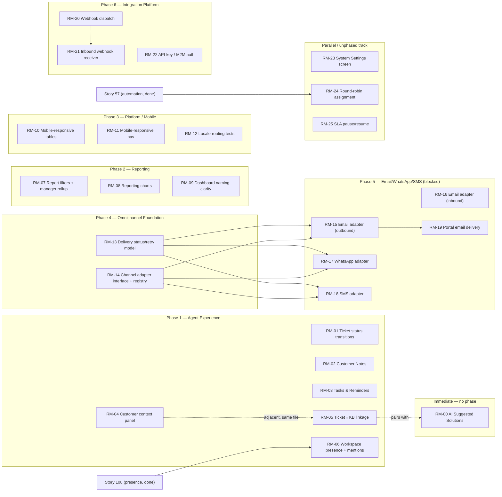

# Dependency Graph &amp; Phased Roadmap

## Story dependency graph

Almost nothing in this roadmap has a hard technical dependency on anything
else in it — most gaps are independent additions to already-complete
domains. The real dependencies are: Phase 4's foundation gating Phase 5's
provider adapters, and `RM-15` gating `RM-19`.

Everything else in Phases 1–3 and the parallel track has **zero** hard
dependency on anything else proposed here — their ordering below is chosen on
value, risk, and size, per the task's explicit "don't blindly follow a fixed
list order" instruction, not on a technical blocker.

---

## Phase 0 — Product Decisions / Unblocking

**No code in this phase.** Decisions required (full records in
`02-product-decisions.md`):

1. Email — self-host an outbound SMTP relay vs. a capped free-tier relay vs.
   accept a future paid ESP, and accept the associated deliverability/ops
   risk. **Not blocking** the outbound engineering work itself (`RM-15` can
   build and fully test against the already-running Mailhog sandbox today) —
   only blocking a production rollout of real external delivery.
2. WhatsApp — no zero-cost provider confirmed; requires the product owner to
   either accept Meta's paid tiers beyond a limited free allotment, or decide
   this channel stays unbuilt. **Fully blocking** — no engineering can
   usefully start (there is nothing provider-neutral left to build once
   Phase 4's foundation exists; the entire remaining scope is the adapter
   itself).
3. SMS — same as WhatsApp: no zero-cost provider confirmed, fully blocking on
   accepting a paid aggregator.
4. ERP/protocol — which system (if any) to integrate with, and whether that
   system itself meets the zero-cost preference order. **Fully blocking** —
   explicitly deferred by this repo's own architecture docs already.

**What can proceed immediately, regardless of Phase 0's outcome:** every
story in Phases 1–4 and 6, plus `RM-00`, plus the parallel track — none of
them touch Email/WhatsApp/SMS/ERP at all. This is the majority of the
remaining Core Feature gap.

---

## Immediate — `RM-00` AI Suggested Solutions

Sits outside the phase numbering the task specified (Phases 1–6 have no
"AI Features" phase) because it was investigated as its own feasibility
question (`02-product-decisions.md`, Decision Record 5), confirmed fully
unblocked, and — per the analysis in "Recommended next story" below — is
this roadmap's single best starting point. Recommended to execute first,
before Phase 1 begins.

---

## Phase 1 — Agent Experience Completion

Dependency analysis (not the task's given list order): none of the six items
below technically depend on each other. Sequencing is by size/risk first,
then daily-value, then the two ticket-detail-view additions grouped adjacent
to reduce merge friction:

1. **`RM-01`** Formal ticket status transition rules — smallest, purely
   backend, zero UI-coupling risk; a correctness guardrail worth closing
   before more ticket-workspace UI work accumulates around an unconstrained
   field.
2. **`RM-02`** Customer Notes — small, isolated, direct copy of the existing
   `TicketNote` pattern.
3. **`RM-03`** Agent Tasks &amp; Reminders — the one P0 item in this phase; a
   genuinely new capability (new model, new UI surface, worker-fired
   reminders), sequenced after the two small wins above to bank early
   momentum before the larger piece of work.
4. **`RM-04`** Embedded customer context panel — small-medium, pure frontend
   composition of already-existing endpoints, high daily-value.
5. **`RM-05`** Ticket ↔ Knowledge Base linkage — medium; sequenced right
   after `RM-04` since both add cards to the same `TicketDetailView` region,
   reducing merge conflict risk if done back-to-back. Also sets up the
   "reference on ticket" action `RM-00` (AI Suggested Solutions) can use once
   both exist.
6. **`RM-06`** Workspace presence + @mentions — the largest item (extends
   Story 108's presence foundation into the workspace, adds net-new
   @mention parsing/notification); sequenced last in this phase as the most
   substantial piece.

---

## Phase 2 — Reporting / Management Completion

**Verified before proposing:** `reporting-saved-dashboards` (Story 110) —
its own plan states outright that no charting library exists in this
codebase and that adding one was explicitly out of scope for that Story.
Confirmed still true at current HEAD. No existing abstraction is being
duplicated by `RM-08`.

1. **`RM-07`** Cross-dimension filters (branch/department/agent/category) +
   a manager cross-branch rollup — sequenced first because it changes the
   query/DTO layer; charts should render whatever the final filtered-query
   shape produces, not be built against the pre-filter shape and reworked
   after.
2. **`RM-08`** Reporting charts — sequenced second, reads the same
   (now filterable) data.
3. **`RM-09`** Dashboard/Reports naming clarity + the agent-performance
   dual-semantics UI cue — small, deliberately last; a polish pass once the
   underlying data shape has settled from `RM-07`/`RM-08`.

---

## Phase 3 — Platform / Mobile Completion

Reuses `@crm/ui`'s existing `Table` primitive and the shared Tailwind
theme/tokens already extracted into `@crm/config` (Stories `ds-1a`/`ds-1b`)
— no second UI system.

1. **`RM-10`** Mobile-responsive data tables (ticket/customer/user lists) —
   the highest-traffic gap; a responsive variant of the shared `Table`
   component benefits all three list screens at once.
2. **`RM-11`** Mobile-responsive navigation — sequenced after `RM-10` since
   a usable mobile nav matters most once the screens it links to are
   themselves usable on mobile.
3. **`RM-12`** Locale-routing test coverage — small, independent, sequenced
   last as a coverage/hardening pass, not a user-facing feature.

Recent, already-in-flight accessibility work (`a11y-1`/`a11y-2`/`a11y-3` —
select labeling, `aria-sort`, skip-to-main-content) is **not duplicated
here**; it is adjacent, ongoing platform-quality work this roadmap treats as
already covered, not a gap to re-plan.

---

## Phase 4 — Omnichannel Foundation

**Verified before proposing:** read `ticket-channel.service.ts`/
`channel-messages.service.ts`'s own doc comments — confirmed `ChannelMessage`
today has no delivery-status field at all (`queued`/`sent`/`delivered`/
`failed`) because Live Chat and Web Form are always instantly "delivered" —
first-party, no external transport. This is a genuine gap for any
externally-delivered channel, not a duplicate of anything already built.

1. **`RM-13`** Channel message delivery-status &amp; retry model — extends
   `ChannelMessage` with delivery lifecycle fields, reusing the existing
   BullMQ retry/backoff pattern.
2. **`RM-14`** Channel adapter interface + registry — formalizes the
   `ChannelAdapter`-shaped interface `docs/architecture/09-integrations.md`
   already describes in prose, wired initially to Live Chat/Web Form's
   existing (implicit, now-named) no-op adapters — sets up the seam Phase 5's
   real adapters plug into without re-architecting anything.

---

## Phase 5 — Email / WhatsApp / SMS

Remains gated on Phase 0's decisions except where noted. **Never one giant
"Omnichannel" story** — five independently deployable stories:

1. **`RM-15`** Email adapter — outbound (SMTP). **Partially unblocked**:
   buildable and fully testable today against the existing Mailhog sandbox;
   gated only before a real production rollout, pending the Phase 0 relay
   decision.
2. **`RM-16`** Email adapter — inbound. Blocked on the same Phase 0
   decision, plus its own larger ops-burden question (self-hosted mail
   receiver vs. an inbound-parse provider).
3. **`RM-17`** WhatsApp adapter. Blocked — no zero-cost provider confirmed.
4. **`RM-18`** SMS adapter. Blocked — no zero-cost provider confirmed.
5. **`RM-19`** Portal email notification delivery. Depends on `RM-15`
   existing; otherwise blocked identically.

---

## Phase 6 — Integration Platform

Generic foundation, fully separated from ERP itself per the task's explicit
instruction. All three items are zero-cost and unblocked (`02-product-
decisions.md`, Decision Record 4):

1. **`RM-20`** Webhook subscriptions + outbound event dispatch.
2. **`RM-21`** Inbound webhook receiver + pluggable signature verification.
3. **`RM-22`** API-key authentication for machine-to-machine consumers.

**ERP adapter itself is not proposed as a story** — ineligible until a
target system/protocol is named (Decision Record 4). Once named, it becomes
a new, separate story building on `RM-20`/`RM-21`/`RM-22`'s registry —
explicitly not bundled into "Complete Integrations" as one story.

---

## Parallel / unphased track

Each item below has zero dependency on anything else in this roadmap and
blocks nothing — safe to interleave with any phase whenever convenient:

- **`RM-23`** Consolidated System Settings screen (also folds in the
  narrowly-scoped remainder of the unbounded-list tech debt Story 106 left
  untouched: Users, Roles, Automation Rules, Quick Replies, SLA Policies).
- **`RM-24`** Round-robin/load-based automatic assignment (extends Story
  57's `AutomationRule`; confirmed safe by that Story's own note that
  `assignedToUserId` is not an SLA-policy-matching field).
- **`RM-25`** SLA pause/resume ("on hold" clock).

---

## Recommended next story

# **`RM-00` — AI Suggested Solutions**

**This is the one recommendation.** Full story file:
[RM-00-ai-suggested-solutions.md](./RM-00-ai-suggested-solutions.md).

**Against each of the seven required criteria:**

1. **Product value.** Closes a named Core 7 requirement ("Suggested
   solutions") that is otherwise the single missing piece of an AI feature
   set the product has already invested in four times over (summaries,
   suggested replies, categorization, chatbot). It is not a conditional or
   speculative value-add — it completes a set the team has already committed
   to and shipped four-fifths of.
2. **Dependency readiness.** Fully ready today — no schema beyond one new
   enum value, no new queue, no new provider, no new credential.
3. **Core Feature coverage.** Directly moves Core 7 (AI Features) from 4/5
   to 5/5 designed capabilities — the only Core 7 gap this roadmap can close
   without a product decision.
4. **Risk reduction.** The lowest-risk P0 candidate available: it is the
   fifth consecutive time this exact shape (async job → `AiPromptLog` →
   realtime hand-back → UI card → graceful `DISABLED` state) will have been
   built in this codebase — the implementation pattern is proven, not novel.
5. **Story size.** Medium, and narrowly bounded — one enum value, one
   provider method, one endpoint, one UI card.
6. **Ability to complete autonomously.** Highest of any P0 candidate
   considered: it requires no new product-shape decisions (unlike `RM-03`
   Tasks & Reminders, which must originate what a "task" even looks like in
   this product, or `RM-20`/`RM-21`, which stand up a genuinely new
   subsystem). An unattended session can execute this correctly end-to-end
   by following an already-four-times-precedented pattern.
7. **Unlocks additional stories.** Pairs directly with `RM-05` (Ticket ↔ KB
   linkage) via the "reference on ticket" action, and completes the AI
   domain's obvious next-natural-increment, consistent with `CLAUDE.md`
   §2's "prefer work that unlocks other required work" and §8's "when one
   domain is complete, move to the next" guidance.

**Runner-up, explicitly considered and not chosen first:** `RM-03` Agent
Tasks &amp; Reminders — also P0, also fully unblocked, and arguably higher
*unconditional* daily-value (it works regardless of any environment
variable, whereas the AI capability remains operationally `DISABLED` in this
particular deployment until `ANTHROPIC_API_KEY` is set). It was not chosen
first because it carries materially more product-shape ambiguity for an
unattended session to resolve alone (task fields, reminder-firing
mechanics, dashboard placement) with no existing precedent in this codebase
to follow, versus `RM-00`'s fully mechanical, four-times-proven shape. It is
the clear, fully-qualified next story after `RM-00`.

Do not choose a story merely because it is easy: `RM-00` is recommended
because it is simultaneously the highest-confidence, lowest-ambiguity, and
most directly Core-Feature-completing option among the unblocked P0
candidates — not because it is the smallest.
